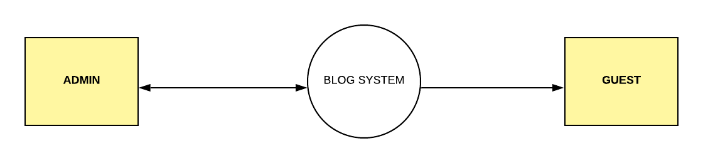
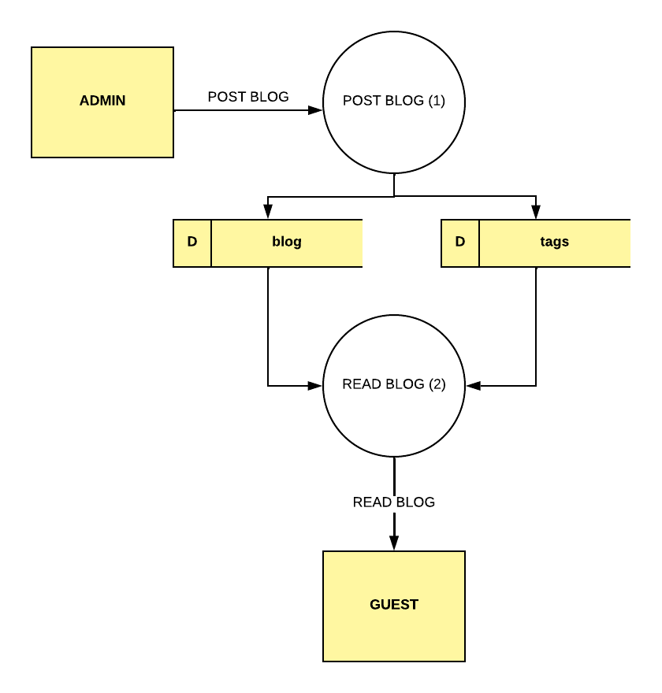
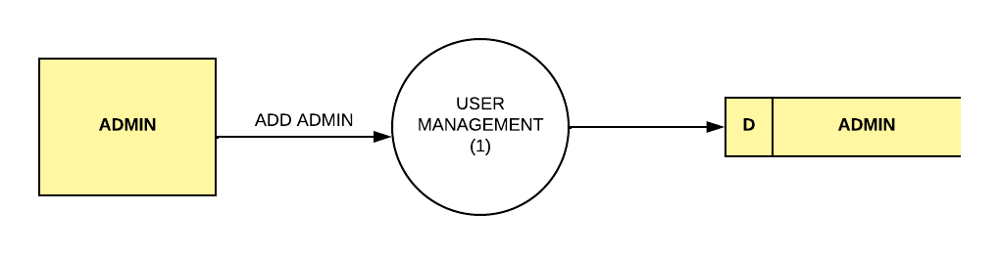

# Data Flow Diagram
In this section we will be focused on how the data flow

## DFD for blog post

### DFD Level 0

Explaination :

* Admin can add or read blog post
* Guest just can read the blog post

### DFD Level 1

Explainations:

* Admin add blog post and save it to table blog
* Admin add tag to the blog post and save the tag to tags table
* Guest can read blog post from table blog and tags table

## DFD for admin

Admin can add another admin and then save it to admin table