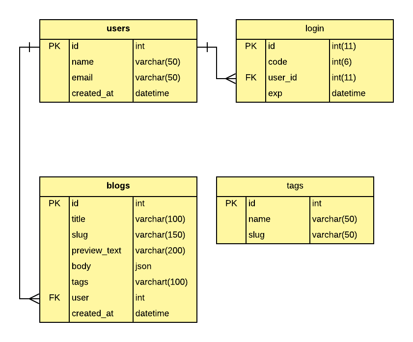

# Entity Relationship Diagram
In this section we will desribe about the tables end its entities

## General ERD

## Table explainations

* Users

    Users table used for storing user personal data

    | Name | Type | Auto Increment | Length | Default | Description |
    | ---- | ---- | -------------- | ------ | ------- | ----------- |
    | id | INT | `Yes` | 11 | 0 | User's id it's auto increment |
    | name | varchar | No | 50 | NULL | User's name e.g Jhon |
    | email | varchar | No | 50 | NULL | User's email e.g jhon@gmail.com |
    | created_at | datetime | No | NULL | DATETIME.NOW() | Creation date |

* Login

    Login used for storing login information, login process will be using `OTP` sended to email

    | Name | Type | Auto Increment | Length | Default | Description |
    | ---- | ---- | -------------- | ------ | ------- | ----------- |
    | id | int | `Yes` | 11 | 0 | login id |
    | code | int | No | 6 | 0 | `OTP` code that sended to user's email |
    | user_id | int | No | 11 | 0 | user's id |
    | exp | datetime | No | NULL | DATETIME.NOW() | expiration OTP code it must be `15 minutes` |

* Blogs

    Blogs table used for storing blog data

    | Name | Type | Auto Increment | Length | Default | Description |
    | ---- | ---- | -------------- | ------ | ------- | ----------- |
    | id | int | `Yes` | 11 | 0 | blog id |
    | title | varchar | No | 100 | NULL | blog's title |
    | slug | varchar | No | 150 | NULL | replace the space and punctuation from title by `dash (-)` |
    | preview_text | varchar | No | 150 | NULL | first blog paragraph for shown as preview blog post |
    | body | json | No | NULL | NULL | body of the blog post from `editor.js` data |
    | tags | varchar | No | NULL | NULL | blog's tag separated with comma if more than 1 tags e.g machine-learning, ai, finance |
    | user | int | No | 11 | 0 | user's id |
    | created_at | datetime | No | NULL | DATETIME.NOW() | Creation date |

* Tags

    Tags table used for storing tags data
    
    | Name | Type | Auto Increment | Length | Default | Description |
    | ---- | ---- | -------------- | ------ | ------- | ----------- |
    | id | int | `Yes` | 11 | 0 | tags id |
    | name | varchar | No | 50 | NULL | tags name e.g machine learning |
    | slug | varchar | No | 50 | NULL | space or punctuation from name replaced by using `-` (dash) e.g `machine-learning` |
