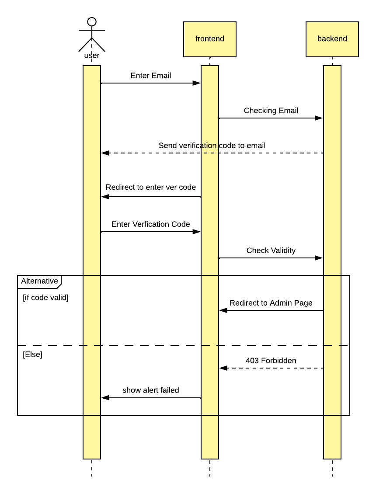
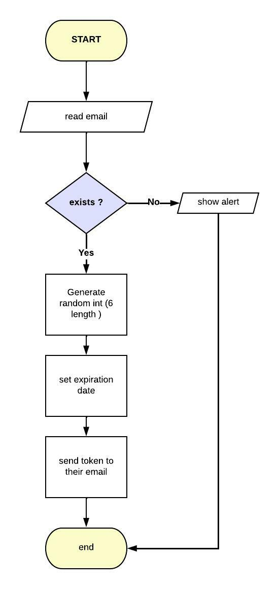
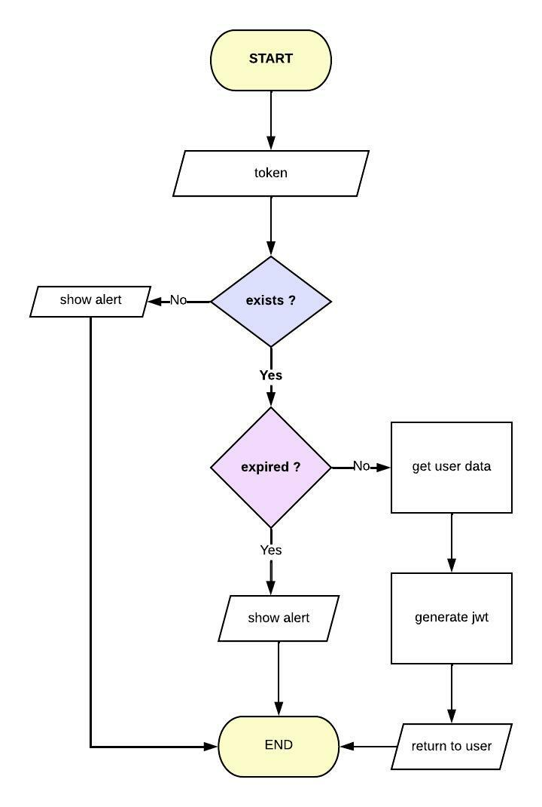

# Flowcharts Authentication
In this section contain flowchart just for the most important aspect because others can be adjustable as needed and it's easy i am swear

## Admin Login

## Authentication Process

## Token Verification

Once code sent then, user will enter the OTP code and then this is the process to validate the token

